# 🎨 SketchGenius

**SketchGenius** is an easy-to-use, AI-powered tool that helps turn text, images, or photos into eye-catching **sketch-style animated videos**. It offers multiple styles like 🖍️ crayon, ✏️ charcoal, 🖤 chalkboard, and 🗂️ blueprint, making content unique and engaging.

With built-in features such as:
- 🗣️ Text-to-Speech
- 🎙️ Speech-to-Text
- 🌐 Language Translation
- 🎶 Royalty-Free Images & Music
- 🖱️ Drag-and-Drop Editor

Anyone can create professional-quality videos without design or technical skills. Perfect for businesses, educators, and creators to boost engagement, explain ideas, or market products quickly and affordably.

---

## 🗂️ Scheme

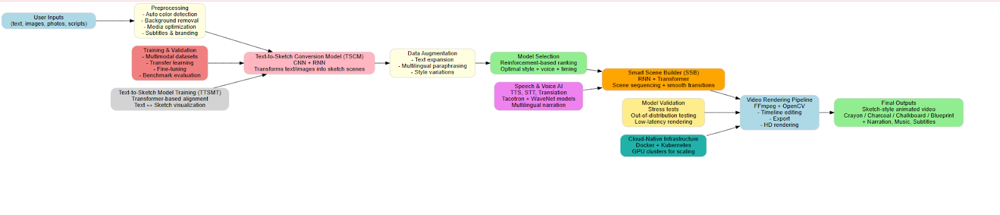

---

## 🧩 Technical Description

*(Detailed technical description goes here, see “Process” and “Technologies” below)*

---

## 🖼️ Screenshots

    
 🖼️ Screenshots

    <table>
        <tbody>
            <tr>
                <td>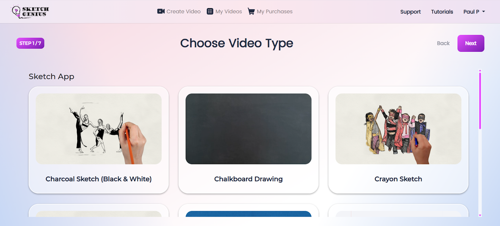</td>
                <td>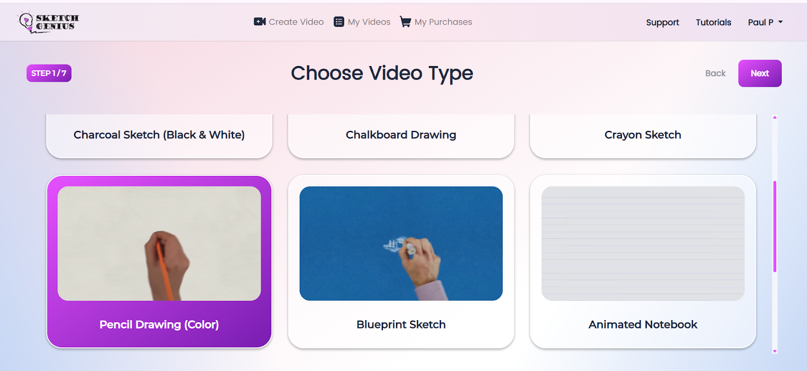</td>
            </tr>
            <tr>
                <td>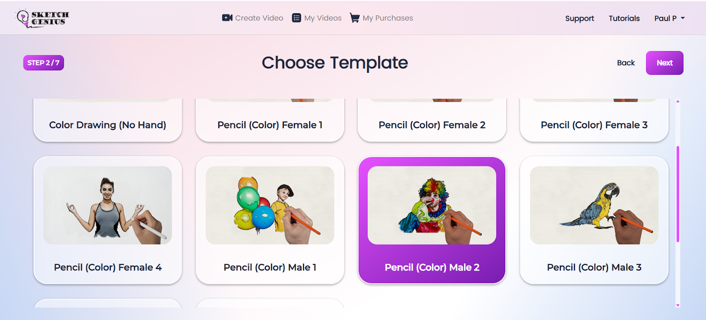</td>
                <td>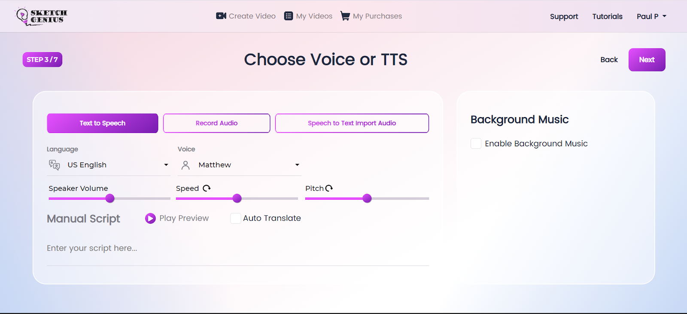</td>
            </tr>
            <tr>
                <td>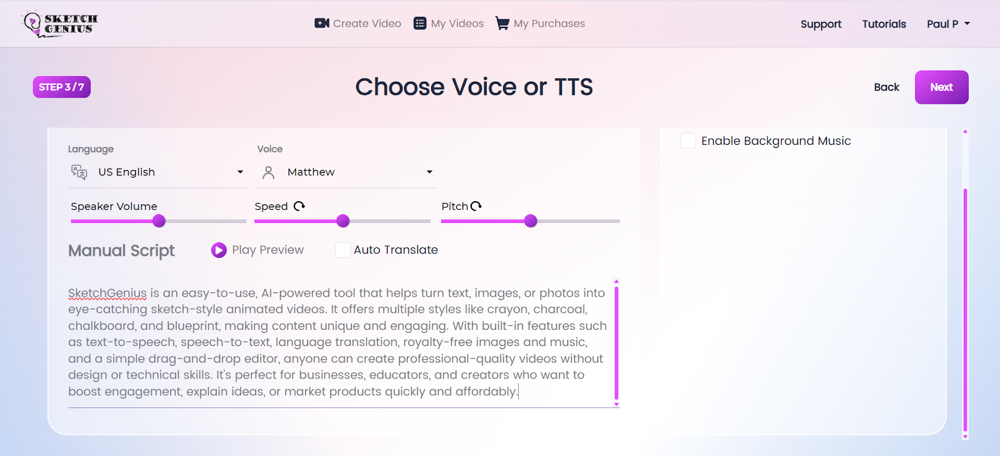</td>
                <td>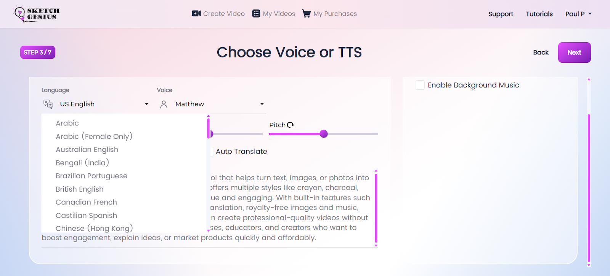</td>
            </tr>
            <tr>
                <td>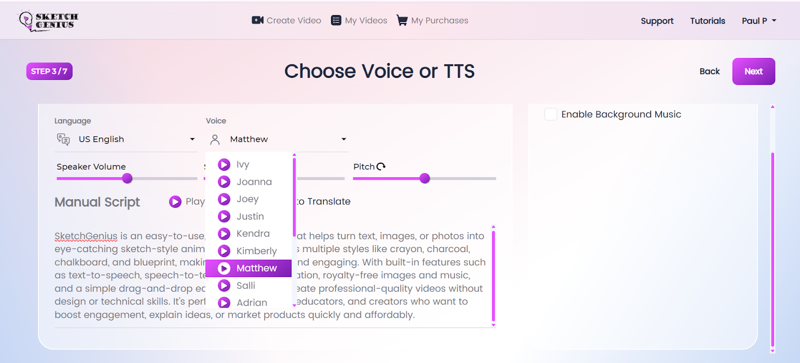</td>
                <td>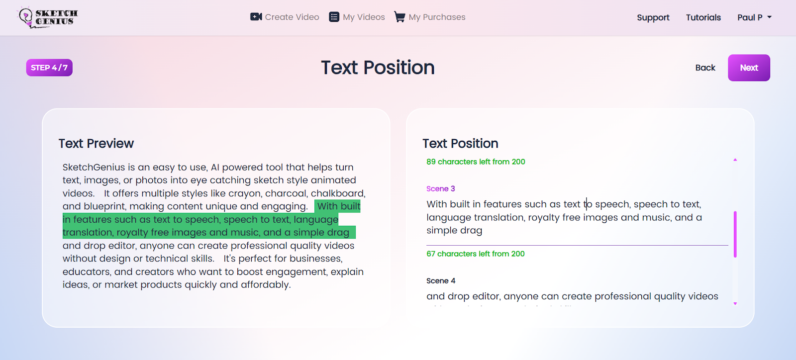</td>
            </tr>
            <tr>
                <td>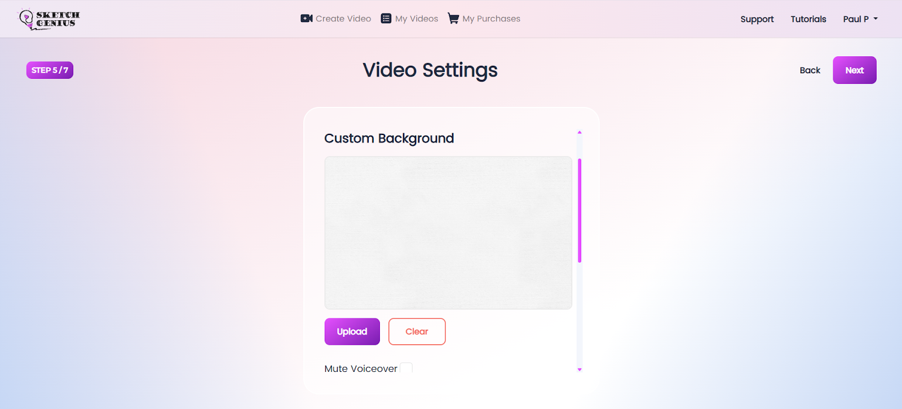</td>
                <td>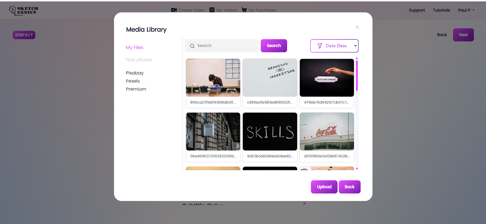</td>
            </tr>
            <tr>
                <td>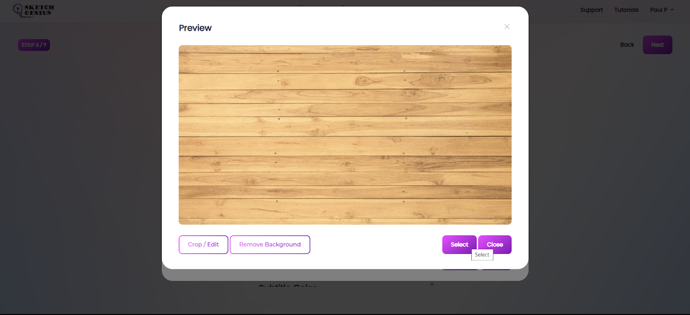</td>
                <td>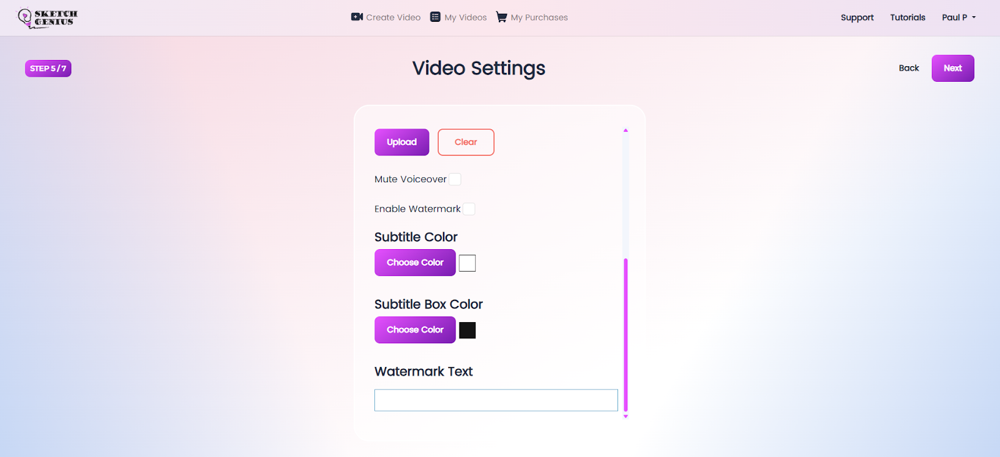</td>
            </tr>
            <tr>
                <td></td>
                <td>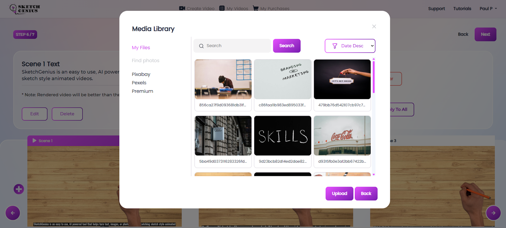</td>
            </tr>
            <tr>
                <td>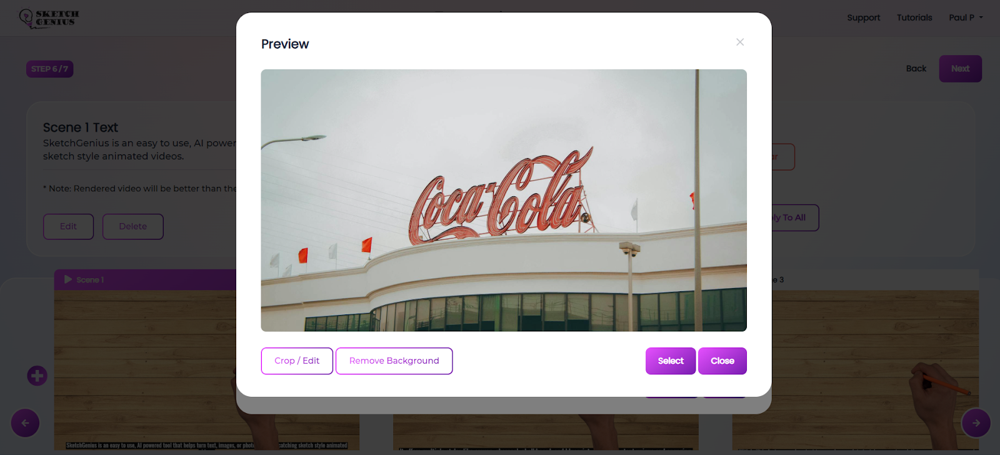</td>
                <td>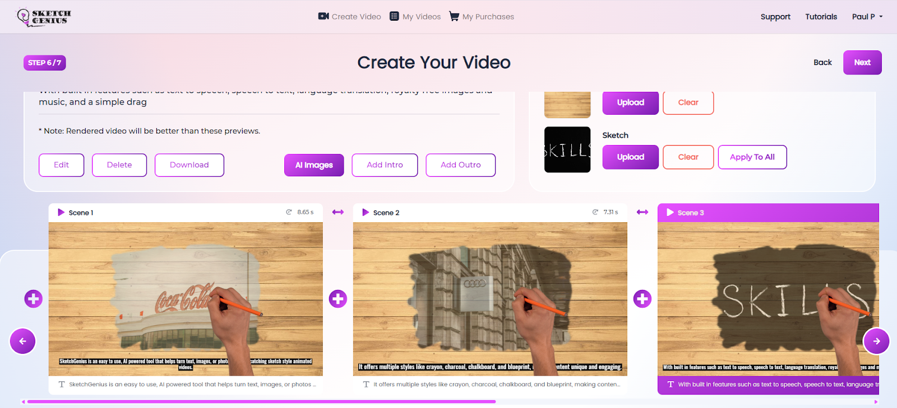</td>
            </tr>
            <tr>
                <td>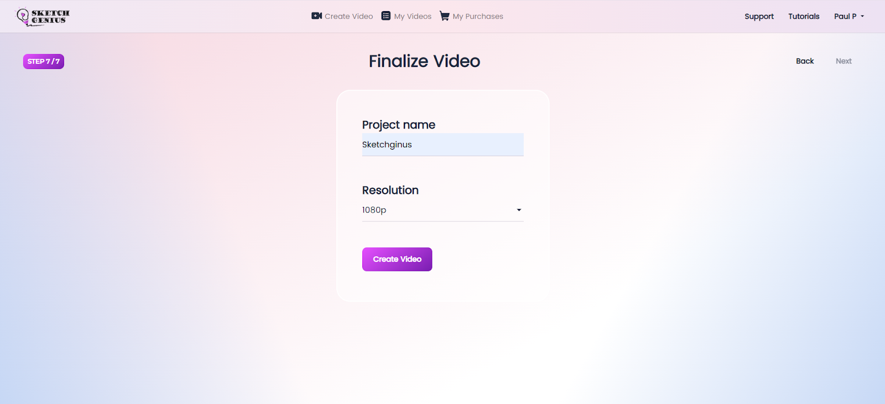</td>
                <td>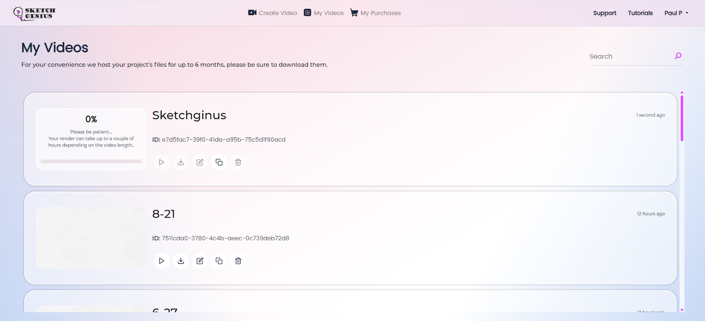</td>
            </tr>
        </tbody>
    </table>

## 🎬 Examples

    
Screen recording

    <table>
        <tbody>
            <tr>
                <td>
                    <video src="https://github.com/user-attachments/assets/081faad5-aad3-40d1-87bb-fcec2fa53996" controls preload>
                        Your browser does not support the video tag.
                    </video>
                </td>
                <td>
                    <video src="https://github.com/user-attachments/assets/f89b3850-edde-4790-9e51-052c4499ec7d" controls preload>
                        Your browser does not support the video tag.
                    </video>
                </td>
            </tr>
            <tr>
                <td>
                    <video src="https://github.com/user-attachments/assets/f3d48048-fd0c-48e2-b2b7-4d0072f19d80" controls preload>
                        Your browser does not support the video tag.
                    </video>
                </td>
                <td>
                    <video src="https://github.com/user-attachments/assets/b9d6a538-0d2b-40d5-a0e6-feedeb4f11a6" controls preload>
                        Your browser does not support the video tag.
                    </video>
                </td>
            </tr>
            <tr>
                <td>
                    <video src="https://github.com/user-attachments/assets/c5b51d79-fb78-43a2-8443-98c2a28cc5fa" controls preload>
                        Your browser does not support the video tag.
                    </video>
                </td>
                <td>
                    <video src="https://github.com/user-attachments/assets/e4030013-d137-4a79-8b92-b5bc22729ff8" controls preload>
                        Your browser does not support the video tag.
                    </video>
                </td>
            </tr>
            <tr>
                <td>
                    <video src="https://github.com/user-attachments/assets/122b5f6f-7459-47a6-b553-22fc9acbf194" controls preload>
                        Your browser does not support the video tag.
                    </video>
                </td>
            </tr>
        </tbody>
    </table>

---

## 📝 Full Description

### ❗ Problem
Video marketing and digital storytelling have become critical for engagement, but producing high-quality animations is often expensive, time-consuming, and technically demanding. Challenges include:
- 💸 High cost of hiring animators or freelancers
- 🖥️ Complex software that requires advanced editing skills
- 🎨 Limited creative flexibility with traditional tools
- 🌎 Lack of multilingual support for global audiences

---

### ✅ Solution
SketchGenius provides a one-stop platform for creating **sketch-style animated videos** quickly and affordably.
- 🧠 AI-driven workflow automates sketch rendering, voiceover generation, translation, and media integration.
- ⏱️ Reduces production time from weeks to minutes.
- 🌐 Delivers visually appealing, multilingual, and impactful content at scale.

---

## ⚙️ Process

### 1️⃣ Preprocessing
- User inputs (text/images/scripts) are analyzed and segmented.
- 🖌️ Auto color detection, background removal, and media optimization.
- Subtitles, watermarks, and branding generated automatically.

### 2️⃣ Text to Sketch Conversion Model (TSCM – Hybrid CNN + RNN)
- CNNs for feature extraction
- RNNs for sequential rendering
- Maintains stylistic consistency across multiple themes (crayon, charcoal, chalkboard, blueprint)

### 3️⃣ Data Augmentation Techniques
- Synthetic text expansion
- Multilingual paraphrasing
- Image style variations

### 4️⃣ Model Selection
- Dynamic selection from library of pre-trained sketch & voice models
- Reinforcement-driven ranking mechanism for optimal style, voice, and timing

### 5️⃣ Smart Scene Builder (SSB – RNN + Transformer)
- Combines RNNs for temporal sequencing with Transformer architectures
- Ensures smooth transitions and consistent pacing

### 6️⃣ Training and Validation
- Multimodal datasets: image, text, sketch samples
- Transfer learning & fine-tuning for new styles and languages
- Stress tests: custom backgrounds, subtitles, and voice overlays

### 7️⃣ Evaluation Metrics
- ✅ Accuracy – faithfulness to text/input image
- 🎨 Visual Quality – human feedback & automated scoring
- 📊 Engagement Impact – viewer retention & interaction metrics

---

## 🛠️ Technologies

- **Computer Vision & Image Processing:** Photo-to-sketch conversion, style transfer
- **NLP:** Text-to-speech, speech-to-text, multilingual translation
- **Deep Learning:** CNNs, RNNs, Transformers
- **Generative AI & Style Transfer:** Neural style transfer + reinforcement learning
- **Speech Synthesis & Voice AI:** WaveNet/Tacotron-based narration, accents, translation
- **Cloud-Native Infrastructure:** Docker/Kubernetes, GPU clusters
- **Frameworks:** PyTorch, TensorFlow/Keras, OpenCV, FFmpeg, Hugging Face Transformers, gRPC & REST APIs
- **Web:** React.js (frontend), Node.js + Express (backend)

---

## 📦 Datasets

- **Image–Sketch Datasets:** Sketchy Database, TU-Berlin, QuickDraw, custom proprietary datasets
- **Speech & Text Datasets:** LibriSpeech, Common Voice (Mozilla), Multilingual TEDx, proprietary voices & accents
- **Video Engagement Datasets:** Proprietary A/B testing data from beta tests

---

## 🔮 Future Scope

- 🎨 Expanded AI Styles: Watercolor, comic book, digital ink
- 👥 Enhanced Collaboration: Real-time multi-user editing
- 🕶️ AR/VR Integration: Immersive learning & marketing
- 🛒 Marketplace Ecosystem: Share or sell custom templates and voices
- 🗣️ Smarter AI Narration: Adaptive voiceovers with emotional tone & context-awareness

---

## 📚 References

1. GENIUS: Sketch-based Language Model Pre-training – Biyang Guo et al.
2. The Sketchy Database: Learning to Retrieve Badly Drawn Bunnies – David E. Shillingford et al.
3. EfficientDet: Scalable and Efficient Object Detection – Mingxing Tan et al.

