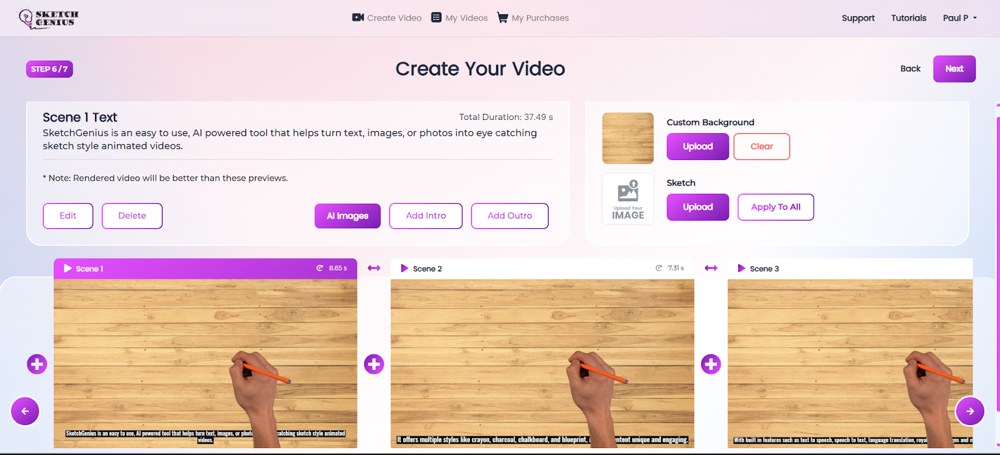

# 🎨 SketchGenius

**SketchGenius** is an easy-to-use, AI-powered tool that transforms **text, images, or photos** into **eye-catching sketch-style animated videos**. It offers multiple styles such as **🖍️ Crayon, ✏️ Charcoal, 🏫 Chalkboard, and 📐 Blueprint**, making your content unique and engaging.

With built-in features like **text-to-speech (TTS), speech-to-text (STT), language translation 🌎, royalty-free images & music 🎵, and a simple drag-and-drop editor**, anyone can create **professional-quality videos** without design or technical skills.

Perfect for **businesses, educators, and creators** looking to **boost engagement, explain ideas, or market products** quickly and affordably.

---

## 🗂️ Scheme

---

## 🧩 Short Description

**🎨 SketchGenius** is an AI-powered tool that turns **text, images, or photos** into **sketch-style animated videos** in minutes. Choose from styles like **🖍️ Crayon, ✏️ Charcoal, 🏫 Chalkboard, and 📐 Blueprint**, add **voiceovers, translations, and royalty-free media**, and create **professional videos** without any design skills. Perfect for **businesses, educators, and creators** who want to **engage audiences, explain ideas, or market products** quickly and affordably. 🚀

---

## 🖼️ Examples

<table>
    <tbody>
        <tr>
            <td></td>
            <td></td>
        </tr>
        <tr>
            <td></td>
            <td></td>
        </tr>
        <tr>
            <td></td>
            <td></td>
        </tr>
        <tr>
            <td></td>
            <td></td>
        </tr>
        <tr>
            <td></td>
            <td></td>
        </tr>
        <tr>
            <td></td>
            <td></td>
        </tr>
        <tr>
            <td></td>
            <td></td>
        </tr>
        <tr>
            <td></td>
            <td></td>
        </tr>
        <tr>
            <td></td>
            <td></td>
        </tr>
    </tbody>
</table>

## 🎬 Video Examples

### 🎬 Sketch Recording

<table>
    <tbody>
        <tr>
            <td>
                <video src="https://github.com/user-attachments/assets/25637f63-e92b-43a3-9cfb-c730f131d790" controls preload>
                    Your browser does not support the video tag.
                </video>
            </td>
            <td>
                <video src="https://github.com/user-attachments/assets/49d3eea0-c6c3-42ab-a8b3-e6e8000fceec" controls preload>
                    Your browser does not support the video tag.
                </video>
            </td>
        </tr>
        <tr>
            <td>
                <video src="https://github.com/user-attachments/assets/87d5340b-de15-4926-8066-fa3c1be99e45" controls preload>
                    Your browser does not support the video tag.
                </video>
            </td>
            <td>
                <video src="https://github.com/user-attachments/assets/6b8c9b72-71fd-432b-81fd-cf2bf041f11f" controls preload>
                    Your browser does not support the video tag.
                </video>
            </td>
        </tr>
        <tr>
            <td>
                <video src="https://github.com/user-attachments/assets/60c583b9-d34a-4de1-88b3-cb6c89fb73cc" controls preload>
                    Your browser does not support the video tag.
                </video>
            </td>
            <td>
                <video src="https://github.com/user-attachments/assets/8ed3db2a-66f8-4693-9139-8e1d20e229ab" controls preload>
                    Your browser does not support the video tag.
                </video>
            </td>
        </tr>
    </tbody>
</table>

### 🎬 Sketch Video

<table>
    <tbody>
        <tr>
            <td>
                <video src="https://github.com/user-attachments/assets/f6ef6744-afc2-450a-a822-4b9ee81e2fe9" controls preload>
                    Your browser does not support the video tag.
                </video>
            </td>
        </tr>
    </tbody>
</table>

---

## 💡 Full Description

📖 Click to expand the Description

### Problem
Video marketing and digital storytelling are **critical for engagement**, but producing **high-quality animations** is often:
- 💸 Expensive (hiring animators/freelancers)
- 🖥️ Technically complex (advanced editing skills required)
- 🎨 Creatively limiting (traditional tools lack flexibility)
- 🌍 Limited in multilingual support

### Solution
**SketchGenius** provides a **one-stop platform** to create sketch-style animated videos **quickly and affordably**. Its **AI-driven workflow** automates:
- Sketch rendering
- Voiceover generation
- Translation
- Media integration

✅ Reducing production time from **weeks to minutes** and enabling **multilingual, visually appealing, impactful content** at scale.

---

## 🛠️ Process

### Preprocessing
- Analyze and segment **text, images, or uploaded scripts**
- Auto **color detection, background removal, media optimization**
- Generate **subtitles, watermarks, branding** for personalization

### Text to Sketch Conversion Model (TSCM – Hybrid CNN + RNN)
- **CNNs** for feature extraction
- **RNNs** for sequential rendering
- Transforms **semantic text inputs** into structured sketch scenes
- Maintains **stylistic consistency** across **multiple visual themes**

### Data Augmentation
- **Synthetic text expansion**
- **Multilingual paraphrasing**
- **Image style variations**  
  Ensures reliable performance across **marketing, education, product demos** while keeping **creative uniqueness**.

### Model Selection
- Dynamic selection from **pre-trained sketch & voice models**
- Uses **reinforcement-driven ranking** to optimize:
    - Visual style
    - Narration voice
    - Timing & personalization

### Smart Scene Builder (SSB – RNN + Transformer)
- Combines **RNNs** for temporal sequencing
- Uses **Transformers** for contextual understanding
- Produces **dynamic sketch animations** synchronized with narration

### Training & Validation
- Large multimodal datasets (image, text, sketch)
- Transfer learning & fine-tuning for **new styles & languages**
- Validated with **benchmark sets** for accuracy, timing alignment, and personalization

### Text-to-Sketch Model Training (TTSMT – Transformer-based)
- Transformer-based encoders map **semantic meaning to drawing actions**
- Handles both **static scripts** & **dynamic content**

### Model Validation
- Out-of-distribution testing
- Stress tests with **custom backgrounds, subtitles, voice overlays**
- Optimized for **low-latency rendering**

### Evaluation Metrics
- **Accuracy:** Visual output vs input
- **Visual Quality:** Human & automated scoring
- **Engagement Impact:** Viewer retention & interaction

---

## ⚙️ Technologies

### Computer Vision & Image Processing
- Photo-to-sketch conversion, style transfer, auto-color detection
- Large-scale **image–sketch paired datasets**

### Natural Language Processing (NLP)
- Powers **TTS, STT, multilingual translation**
- Aligns **text scripts with video narration**

### Deep Learning
- **CNNs:** Feature extraction
- **RNNs:** Sequential rendering
- **Transformers:** Mapping text to visual actions

### Generative AI & Style Transfer
- Neural style transfer for **different sketch aesthetics**
- Reinforcement learning ensures **frame consistency**

### Speech Synthesis & Voice AI
- WaveNet-style & Tacotron models
- **Male/female voices, regional accents, translations**

### Cloud Infrastructure
- Docker + Kubernetes microservices
- GPU clusters for **parallel HD rendering**

### Frameworks
- **PyTorch, TensorFlow/Keras** – training & inference
- **OpenCV** – preprocessing
- **FFmpeg** – rendering & export
- **Hugging Face Transformers** – NLP
- **gRPC & REST APIs** – integrations
- **React.js & Node.js** – web interface & backend

---

## 📊 Datasets

### Image–Sketch
- **Sketchy Database:** 75,000+ pairs, 125 categories
- **TU-Berlin Sketch Dataset:** 20,000+ sketches
- **QuickDraw (Google):** 50M sketches

### Speech & Text
- **LibriSpeech ASR Corpus**
- **Common Voice (Mozilla)**
- **Multilingual TEDx**

### Video Engagement
- Proprietary A/B testing datasets (marketing & education)

---

## 🔮 Future Scope
- More **artistic styles**: Watercolor, comic, digital ink
- **Real-time collaboration** for teams
- **AR/VR integration** for immersive experiences
- **Marketplace** for sketch templates & voices
- **Adaptive AI narration** with emotional tone

---

## 📚 References
- Guo et al., *GENIUS: Sketch-based Language Model Pre-training via Extreme and Selective Masking*
- Shillingford et al., *The Sketchy Database: Learning to Retrieve Badly Drawn Bunnies*
- Tan et al., *EfficientDet: Scalable and Efficient Object Detection*

---

💡 **With SketchGenius, creating engaging, sketch-style videos has never been easier!** 🚀

